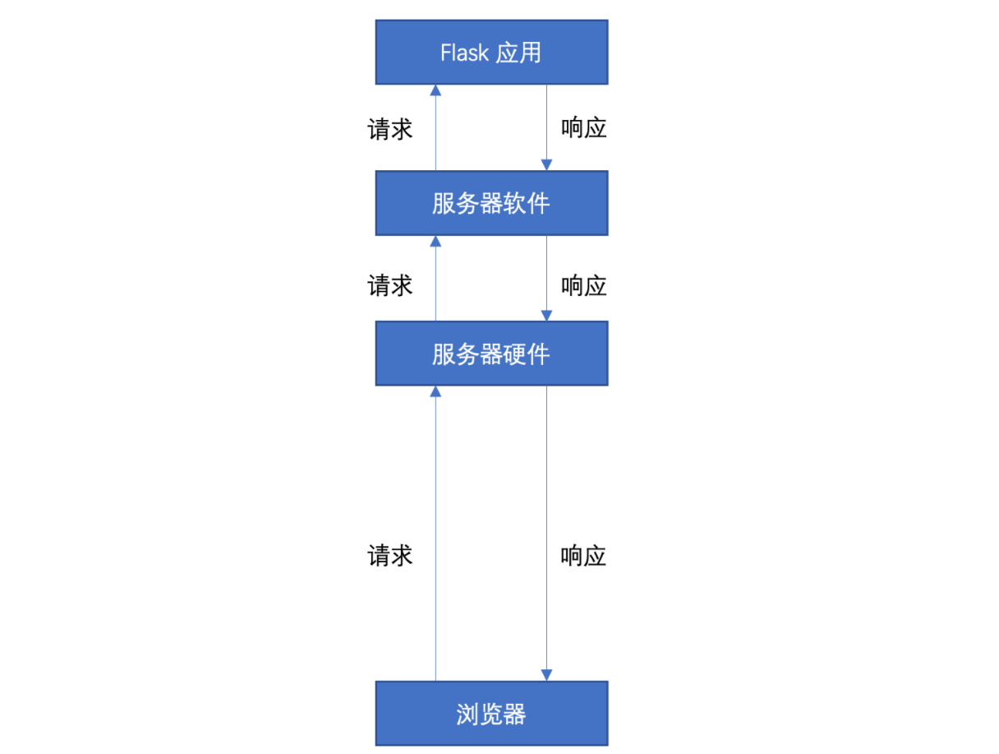

# Flask 作用与流程
---

## 1.为什么要学习 Flask？

对于我们模型部署来说，Flask 的作用是什么呢？

当我们训练好一个模型后，为了能够让它能够对外提供服务。我们一般会将其部署到某一台存在于互联网的服务器上，想要使用该服务的人可以通过网络来远程和部署在服务器的模型进行交互以获得想要的服务。

此时，我们就需要在服务端去编写一个用于和用户交流的应用程序，而 Flask 就是一款可以解决此问题的 Web 框架，它具有轻便、灵活、安全且容易上手，能够在短时间内构建出一个 Web 服务站点。通过 Flask 用户可以提交数据到服务端，服务端可以处理用户请求，并返回处理结果。

## 2. 流程

> 1. Flask 在整个业务流中承担的角色是什么？
> 2. 用户的请求和响应到底是一个什么样的流程？

简要的流程如下:

（1）浏览器给服务器监听在某个端口上的应用程序发送请求；

（2）服务器程序接收到请求之后，将请求转发给具体处理该请求的程序；

（3）该程序解析请求，然后找到该请求对应的处理函数，并执行该函数；

（4）将函数的返回值返回给服务器软件，服务器软件再将返回值返回给浏览器。

