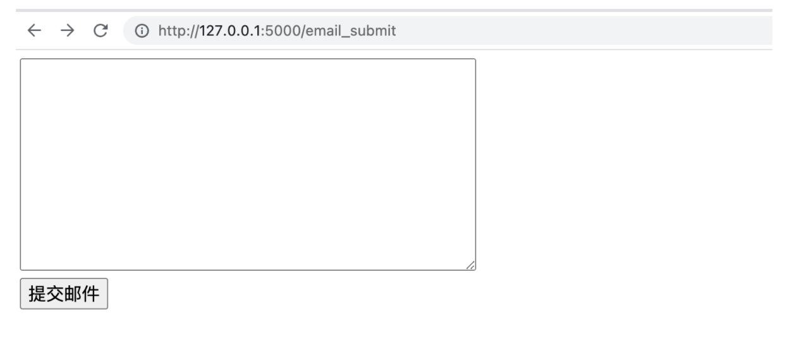
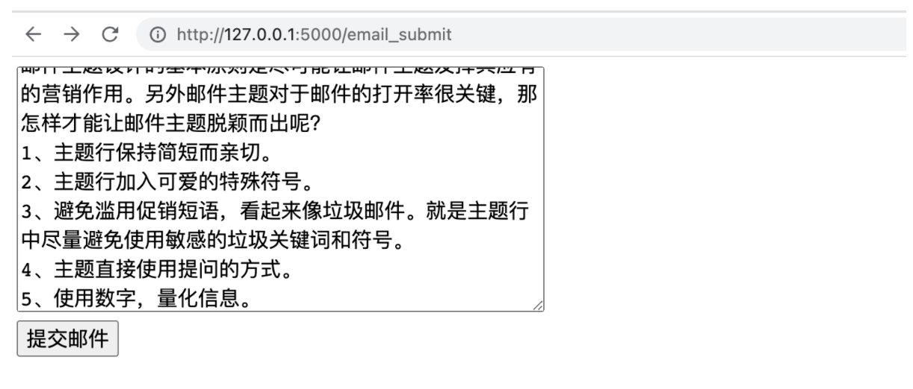
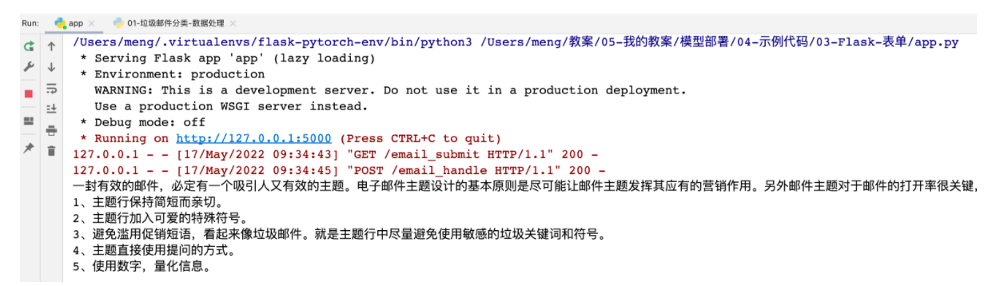

# Flask 表单使用
---

我们在进行模型部署时，经常需要用户传递给我们数据，例如: 一张图片、一封邮件等，然后由我们的部署的模型接收数据，并预测，最后给出响应。表单的用途就是客户用于提交数据的内容。在这里，我们需要学习:

1. 编写表单
2. 处理表单


## 1. 编写表单

当用户访问一个指定的 URL 时，我们需要返回给用户一个表单，让用户在表单中填写相关的内容，并点击某个按钮，将数据提交给我们。

1. 创建 Flask 项目，并创建 app.py 文件，代码内容如下:
2. 在 app.py 同级目录下创建 email_submit.html 文件


app.py 内容如下：

```python
from flask import Flask


# 初始化 Flask 应用
app = Flask(__name__)

@app.route('/email_submit', methods=['GET'])
def email_submit():

    with open('email_submit.html', 'rb') as file:
        content = file.read()

    return content


if __name__ == '__main__':
    app.run()
```


email_submit.html 内容如下:

```python
<!DOCTYPE html>
<html lang="en">
<head>
    <meta charset="UTF-8">
    <title>邮件内容提交</title>
</head>
<body>

<form action="" method="post">
    <textarea name="content" cols="40", rows="10"></textarea>  <br />
    <input type="submit" value="提交邮件" />
</form>

</body>
</html>
```

运行 app.py 文件，并打开浏览器输入: http://127.0.0.1:5000/email_submit, 显示内容如下图所示:




## 2. 处理表单

我们首先需要接收到表单的数据，然后进行处理，当我们接收到表单数据之后，我们就给用户显示到浏览器内。

在 .html 文件内，修改 form 表单的 action 属性如下:

```python
<form action="/email_handle" method="post">
    <textarea name="content" cols="40", rows="10"></textarea>  <br />
    <input type="submit" value="提交邮件" />
</form>
```

在 app.py 中增加额外的业务处理函数 email_handle, 专门用来接收表单发来的邮件数据。

```python
from flask import Flask
from flask import request


# 初始化 Flask 应用
app = Flask(__name__)

@app.route('/email_submit', methods=['GET'])
def email_submit():

    with open('email_submit.html', 'rb') as file:
        content = file.read()

    return content


@app.route('/email_handle', methods=['POST'])
def email_handle():

    email_data = request.form.get('content')
    print(email_data)

    return 'Received Email Data!'


if __name__ == '__main__':
    app.run()
```

重新运行程序，在浏览器输入 http://127.0.0.1:5000/email_submit，并在页面内填写任意文本内容，如下图所示:



点击提交邮件，我们就可以在后台看到以下内容：



这就表示我们获得了用户提交给我们的数据内容。


注意: 客户如果需要提交数据给我们，一般都是通过表单的形式提交。


## 3. 获得其他形式的数据

我们上面编写了一个用于获得一大串文本内容的表单。假设: 我们需要用户提交给我们很多数据，我们就可以编写如下表单:

app.py 内容:

```python
from flask import Flask
from flask import request


# 初始化 Flask 应用
app = Flask(__name__)


@app.route('/userinfo_submit', methods=['GET'])
def userinfo_submit():

    with open('others_submit.html', 'rb') as file:
        content = file.read()

    return content

@app.route('/userinfo_handle', methods=['POST'])
def userinfo_handle():

    name = request.form.get('name')
    age = request.form.get('age')
    sex = request.form.get('sex')

    print('姓名:', name)
    print('年龄:', age)
    print('性别:', sex)

    return 'Received Email Data!'


if __name__ == '__main__':
    app.run()
```

others_submit.html 内容如下:

```html
<!DOCTYPE html>
<html lang="en">
<head>
    <meta charset="UTF-8">
    <title>邮件内容提交</title>
</head>
<body>

<form action="/userinfo_handle" method="post">
    姓名: <input type="text" name="name" /> <br />
    年龄: <input type="text" name="age" />  <br />
    男:<input type="radio" name="sex" value="男" /> 女:<input type="radio" name="sex" value="女" /> <br />
    <input type="submit" value="提交" />
</form>

</body>
</html>
```

