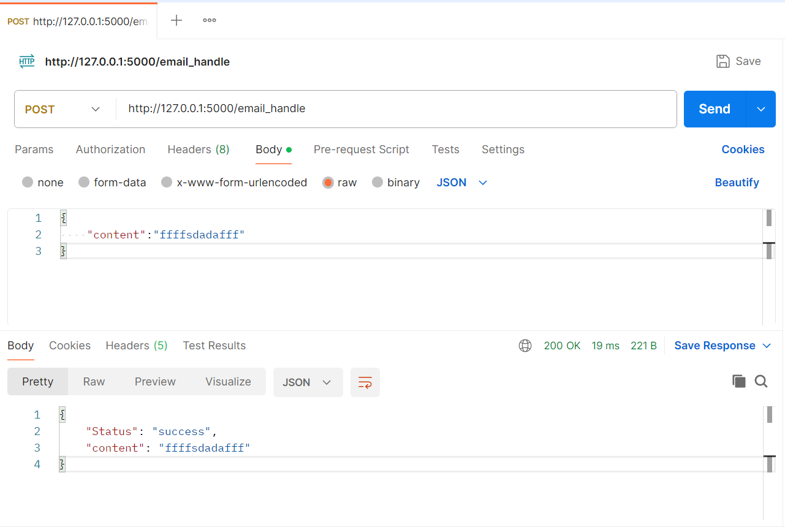

# Flask 服务交付
---

我们在进行模型部署时，首先用户传递给我们数据，大部分情况是json格式的，例如: 

```python
{
    "content":"邮件内容"
}
```

然后由我们的部署的模型接收数据，并预测，最后返回一个json格式的输出。在这里，我们需要学习:

1. json格式数据接收
2. json格式数据返回


我们首先需要接收到json格式的数据，然后进行处理，当我们接收到数据之后，我们就给用户返回对应的json格式的输出。

在 .html 文件内，修改 form 表单的 action 属性如下:

```python
<form action="/email_handle" method="post">
    <textarea name="content" cols="40", rows="10"></textarea>  <br />
    <input type="submit" value="提交邮件" />
</form>
```

在 app.py 中增加额外的业务处理函数 email_handle, 专门用来接收表单发来的邮件数据。

```python
from flask import Flask, Response, json
from flask import request


# 初始化 Flask 应用
app = Flask(__name__)

@app.route('/email_submit', methods=['GET'])
def email_submit():

    with open('email_submit.html', 'rb') as file:
        content = file.read()

    return content


@app.route('/email_handle', methods=['POST'])
def email_handle():
    # 获取json格式的输入
    request_json = request.get_json()
    email_data = request_json['content']

    # 定义响应数据格式
    respose_data = {
        'Status': 'success',
        "content": email_data,
    }
    # 返回请求数据
    return Response(status=200, response=json.dumps(respose_data, sort_keys=False))


if __name__ == '__main__':
    app.run()
```

重新运行程序，使用Postman向 [http://127.0.0.1:5000/email_handle](http://127.0.0.1:5000/email_handle)发送请求，并在返回响应结果，

**请求体：**

```python
{
    "content":"邮件内容"
}
```

**响应体：**

```python
{
    "Status": "success",
    "content": "邮件内容"
}
```


如下图所示:



