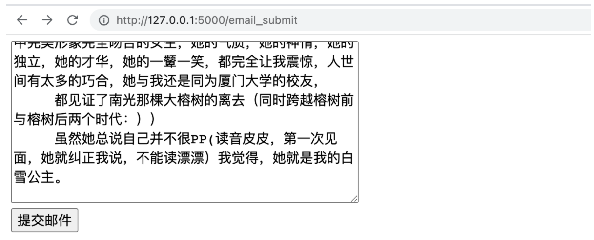
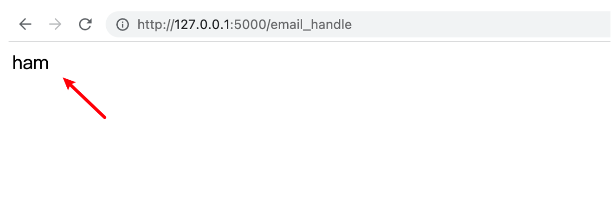

# Flask 服务封装
---

前面我们学习了 Flask 的基本使用，接下来我们将自己训练的《垃圾邮件分类器》通过 Flask 进行部署，使得用户能够通过浏览器提交邮件数据，我们的模型能够对邮件进行分类，并返回给用户结果。


## 1. 业务实现代码

```python
from flask import Flask
from flask import request
from sklearn.feature_extraction.text import CountVectorizer
import pickle
import re
import zhconv
import jieba.posseg as psg
import joblib


app = Flask(__name__)


@app.route('/email_submit', methods=['GET'])
def email_submit():

    with open('email_submit.html', 'rb') as file:
        content = file.read()

    return content


def clean_data(email):

    # 1. 去除非中文字符
    email = re.sub(r'[^\u4e00-\u9fa5]', '', email)
    # 2. 繁体转简体
    email = zhconv.convert(email, 'zh-cn')
    # 3. 邮件词性筛选
    email_pos = psg.cut(email)
    allow_pos = ['n', 'nr', 'ns', 'nt', 'v', 'a']
    email = []
    for word, pos in email_pos:
        if pos in allow_pos:
            email.append(word)

    # 4. 转换成 str 类型
    email = ' '.join(email)


    return email


@app.route('/email_handle', methods=['POST'])
def email_handle():

    # 0. 获得邮件数据
    content = request.form.get('content')

    # 1. 对数据进行清理
    content = clean_data(content)

    # 2. 数据特征提取
    vocab = pickle.load(open('03-模型训练特征.pkl', 'rb'))
    transfer = CountVectorizer(vocabulary=vocab)
    content = transfer.transform([content])

    # 3. 模型加载
    model = joblib.load('04-邮件分类模型.pth')
    output = model.predict(content)
    prediction = output[0]

    # 4. 返回预测结果
    return prediction


if __name__ == '__main__':
    app.run()
```

## 2. 预测结果



当点击提交邮件之后，页面显示内容如下：



虽然，我们能够将我们的模型包装成服务器接口了，但是有个不足之处，当我们要将我们编写的代码部署到某台机器上时，仍然需要重新安装程序依赖各种包环境，非常繁琐。有没有一种办法，能把依赖环境和程序打包到一起，简化部署流程呢？

我们接下来可以使用容器化技术 Docker 来实现。

