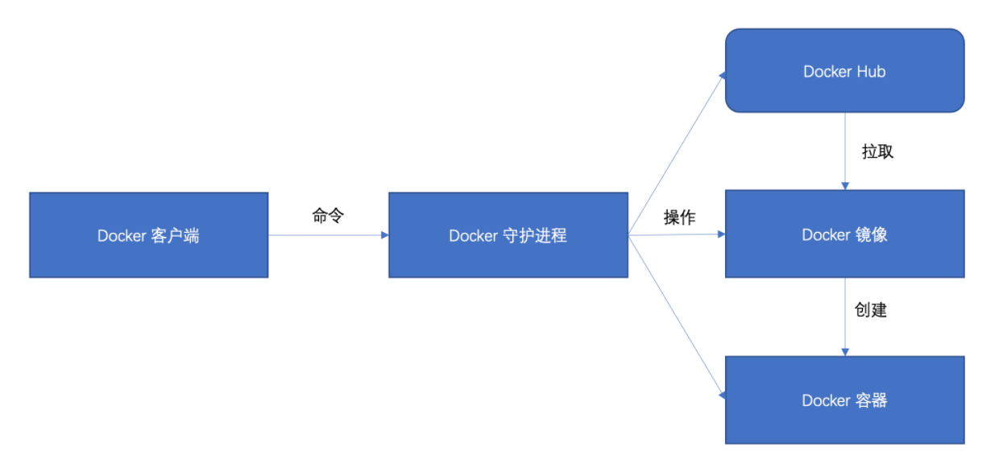

# Docker 介绍安装
---

## 1.Docker简介

官方地址：[https://docs.docker.com/](https://docs.docker.com/)

Docker 是一个基于go语言开发的开源的应用容器引擎，让开发者可以打包他们的应用以及依赖包到一个可移植的容器中，然后发布到任何流行的 Linux 或者 Windows机器上，也可以实现虚拟化。

Docker 是一个用于开发、传送和运行应用程序的开放平台。Docker 使您能够将应用程序与基础设施分开，以便您可以快速交付软件。使用 Docker，您可以像管理应用程序一样管理基础设施。通过利用 Docker 的快速交付、测试和部署代码的方法，您可以显着减少编写代码和在生产中运行代码之间的延迟。Docker(opens new window)是个划时代的开源项目，它彻底释放了计算虚拟化的威力，极大提高了应用的维护效率，降低了云计算应用开发的成本！使用 Docker，可以让应用的部署、测试和分发都变得前所未有的高效和轻松！**无论是应用开发者、运维人员、还是其他信息技术从业人员，都有必要认识和掌握 Docker，节约有限的生命。**


## 2.Docker的主要特点

1. **轻量化**：Docker 容器使用的资源非常少，相比虚拟机技术，一个完整的 Docker 镜像通常只有几十 MB，启动几乎是立即的。
2. **标准化**：Docker 对应用及其依赖进行标准化打包，解决了“在我机器上可以运行，在你机器上就不行”的问题。
3. **可移植性**：可以在不同的平台和不同的环境中运行，例如开发环境、测试环境和生产环境。
4. **版本管理和组件重用**：Docker 可以进行版本管理、组件重用、快速部署等。
5. **隔离性**：Docker 能够提供独立的运行环境，应用程序在 Docker 容器的运行和外部世界进行隔离。

## 3.为什么要使用Docker？

1. **环境一致性**：在开发、测试和生产环境之间建立一致性，消除了“在我电脑上运行得好好的”这种情况。
2. **便于持续集成和持续部署**：Docker能够以最小的代价快速地启动和关闭，这让持续集成和持续部署变得非常简单。
3. **隔离性和安全性**：Docker容器之间彼此隔离，一个容器的崩溃不会影响到其他的容器，提供了额外的层次的安全性。
4. **微服务架构**：Docker非常适合微服务架构。每个微服务可以运行在自己的容器中，每个容器之间是相互隔离的，有自己独立的运行环境。
5. **资源利用率高**：Docker容器共享主机的内核，不需要像虚拟机那样为每个应用程序运行一个完整的操作系统，资源占用更少，启动更快。

因此，Docker 在软件开发、测试和运维中有着广泛的应用。

## 4.Docker核心概念

Docker三大核心概念：镜像 Image、容器 Container、仓库 Repository

### （1）镜像（Image）

Docker 镜像（Image）可以被认为是 Docker 容器的模板。Docker 镜像是用于创建 Docker 容器的基础。简单来说，Docker 镜像就是一个只读的模板，用来创建 Docker 容器，一个镜像可以创建多个容器。

镜像包含了运行容器所需的所有内容，包括代码、运行时、库、环境变量和配置文件等。Docker 镜像是由文件系统叠加而成，每一层都代表 Dockerfile 中的一条指令，层与层之间是互相依赖的。

### （2）容器（Container）

Docker 容器（Container）是 Docker 镜像（Image）运行时的实体。容器可以被创建、启动、停止、删除、暂停等。简单来说，容器就是用镜像创建的运行实例。它可以被启动、开始、停止、移动和删除。每个容器之间是相互隔离的、保护的，每个容器都有自己的文件系统，每个容器之间运行的进程都是相互隔离的。

容器的定义和镜像几乎一样，也是一系列的层的集合，不同的是容器的最上面那一层是可读可写的，而镜像的最上层是只读的。

### （3）仓库（Repository）

Docker 仓库（Repository）是用来保存镜像的地方。Docker 仓库可以被认为是代码控制中的代码仓库一样。Docker 用户可以在仓库中创建一个账户，存储和分享自己的镜像。也可以从 Docker 仓库中下载别人分享的镜像。

Docker 仓库分为公开和私有两种形式。公开的 Docker 仓库是 Docker 公司提供的，可以被所有用户使用。DockerHub 就是最知名的公开 Docker 仓库。私有的 Docker 仓库可以在本地部署，只能被内部用户使用。

总结来说，Docker 的工作流程是，首先从 Docker 仓库中获取 Docker 镜像，然后用这个镜像创建 Docker 容器，最后对容器进行操作（启动、停止等）。

## 5.Docker的核心架构

在 Docker 主要有以下几部分组成：

1. Docker 客户端，负责与 Docker 守护进行通信；
2. Docker 守护进程，负责管理 Docker 镜像和 Docker 容器；
3. Docker 镜像，负责产生 Docker 容器实例；
4. Docker 容器，包含了应用程序和其所依赖环境。
5. Docker Hub，已经制作好了很多镜像




链接：https://hub.docker.com/


## 6.Centos Docker 安装

### （1）Docker自动化安装

**官方的一键安装方式：**

```shell
curl -fsSL https://get.docker.com | bash -s docker --mirror Aliyun
```

**国内daocloud一键安装命令：**

```shell
curl -sSL https://get.daocloud.io/docker | sh
```


执行上述任一条命令，耐心等待即可完成Docker的安装。

### （2）Docker手动安装

```python
# 安装依赖工具 
# yum-utils提供yum-config-manager
# device mapper存储驱动程序需要device-mapper-persistent-data和lvm2。
sudo yum install -y yum-utils device-mapper-persistent-data lvm2

# 配置镜像源， 我们使用的是阿里云的源
yum-config-manager --add-repo http://mirrors.aliyun.com/docker-ce/linux/centos/docker-ce.repo
yum makecache fast

# 安装 Docker
yum install docker-ce docker-ce-cli containerd.io
```

安装命令执行成功之后，使用下面命令来管理Docker 守护进程：

```python
# 查看 docker 版本
docker version
# 启动 docker 服务
systemctl start docker 
# 关闭 docker 服务
systemctl stop docker
# 重启 docker 服务
systemctl restart docker
# 查看 docker 状态
systemctl status docker
# 设置开机启动
systemctl enable docker
```


