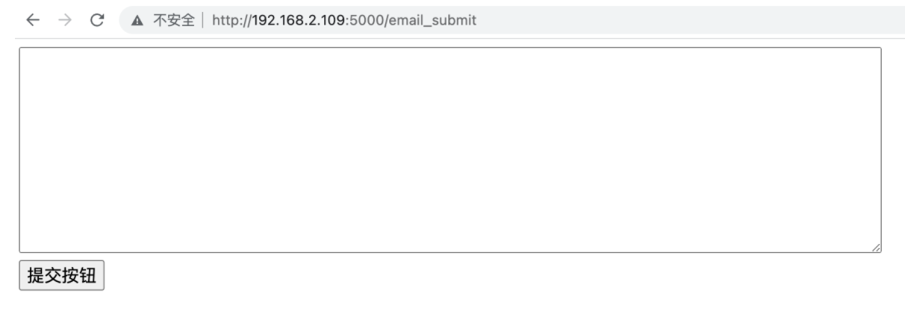

# Docker 手动构建镜像
---

我们可以把 Docker 容器当做一个普通的 Linux 系统，在里面安装我们需要的软件。我们接下来，要在容器中部署《垃圾邮件分类器》模型，我们可以按照下面的步骤完成。


## 1. 整理项目

我们在第二章节编写的服务接口目录结构如下:

```python
02-服务接口
├── 01-Flask-Hello-World.py
├── 02-Flask-表单处理.py
├── 03-表单处理扩展.py
├── 04-服务接口.py
├── 05-模型训练特征.pkl
├── 06-邮件分类模型.pth
├── email_submit.html
└── other.html
```

其中有用的文件为:
```python
02-服务接口
├── 04-服务接口.py
├── 05-模型训练特征.pkl
├── 06-邮件分类模型.pth
├── email_submit.html
```

文件名更改:

1. 04-服务接口.py 更改为 app.py
2. 05-模型训练特征.pkl 更改为 feature.pkl
3. 06-邮件分类模型.pth 更改为 spam-model.pth

将其放在 app 目录下，目录结构为：

```python
app
├── app.py
├── features.pkl
├── spam-model.pth
└── email_submit.html
```

至此, 项目文件正例完毕.


## 2. 制作镜像

```python
# 1. 下载基础镜像
docker pull python:3.7.5

# 2. 创建容器时，指定容器的映射端口、工作目录
docker run -it -p 5000:5000 -w /root/app python:3.7.5 /bin/bash

# 3. 安装 app 依赖的 Python 包
pip install pandas flask scikit-learn jieba zhconv -i https://pypi.tuna.tsinghua.edu.cn/simple

# 4. 退出容器
exit

# 5. 将 app 拷贝到容器 /root 目录下
docker cp app/ 容器ID:/root

# 6. 进入容器，启动服务测试
docker start 容器ID
docker exec -it 容器ID /bin/bash
python app.py

# 注意: 如果启动服务之后，在浏览器能够正常访问则进行下面的步骤

# 7. 将容器存储为镜像
docker stop 镜像ID
docker export 容器ID > spam.tar 

# 8. 将 tar 包导入为本地镜像
# 此时, 假设我们在另外一台服务器部署镜像
docker import spam.tar spam:1.0

# 9. 启动 docker 容器服务
docker run -d -p 5000:5000 -w /root/app spam:1.0 python app.py

# 查看镜像是否正在运行
docker ps

# 10. 浏览器输入: http://宿主机IP:5000/email_submit 出现下面界面，则镜像工作正常
```




