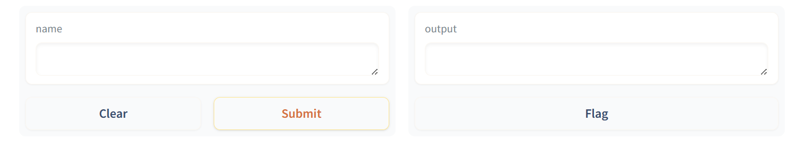

# Gradio 安装&基本用法

## 1.环境要求和安装命令

Python第三方库Gradio快速上手，当前版本V4.21.0 * python版本要求3.8及以上

```python
pip install gradio

#为了更快安装，可以使用清华镜像源
pip install gradio -i https://pypi.tuna.tsinghua.edu.cn/simple
```

安装完直接在IDE上启动快速，

## 2.快速入门

```python
# 导入依赖包Gradio
import gradio as gr

# 输入文本处理程序
def greet(name):
    return "Hello " + name + "!"

# 接口创建函数
# fn设置处理函数，inputs设置输入接口组件，outputs设置输出接口组件
# fn,inputs,outputs都是必填函数
demo = gr.Interface(fn=greet, inputs="text", outputs="text")

# 启动服务，监听端口7860
demo.launch()
```

运行程序后，打开 http://localhost:7860 即可看到网页效果。左边是文本输入框，右边是结果展示框。Clear按钮用于重置网页状态，Submit按钮用于执行处理程序，Flag按钮用于保存结果到本地。

```python
#执行结果
Running on local URL:  http://127.0.0.1:7860

To create a public link, set `share=True` in `launch()`.
```

打开浏览器使用即可


