# Gradio 基本参数

## 1. Interface类介绍

### 1.1 Interface类及基础模块

#### （1）Interface类

Gradio 可以包装几乎任何 Python 函数为易于使用的用户界面。从上面例子我们看到，简单的基于文本的函数。但这个函数还可以处理很多类型。 Interface类通过以下三个参数进行初始化：

- fn：包装的函数
- inputs：输入组件类型，（例如：“text”、"image）
- ouputs：输出组件类型，（例如：“text”、"image）

通过这三个参数，我们可以快速创建一个接口并发布他们。

#### （2） 基础模块

最常用的基础模块构成。

**（1）应用界面**

- gr.Interface(简易场景)
- gr.Blocks(定制化场景)

**（2）输入输出**   

- gr.Image(图像)
- gr.Textbox(文本框)
- gr.DataFrame(数据框)
- gr.Dropdown(下拉选项)
- gr.Number(数字)
- gr.Markdown(Markdown文本)
- gr.Files(文件)

**（3）控制组件**

- gr.Button(按钮)

**（4）布局组件**

- gr.Tab(标签页)
- gr.Row(行布局)
- gr.Column(列布局)

### 1.2 应用实例

#### （1）自定义输入组件

```python
import gradio as gr

def greet(name):
    return "Hello " + name + "!"

demo = gr.Interface(
    fn=greet,
    # 自定义输入框
    # 具体设置方法查看官方文档
    inputs=gr.Textbox(lines=3, placeholder="Name Here...",label="my input"),
    outputs="text",
)

demo.launch()
```

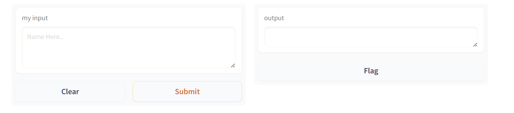


- **Interface.launch()方法返回三个值**
  - app，为 Gradio 演示提供支持的 FastAPI 应用程序
  
  - local_url，本地地址
  - share_url，公共地址，当share=True时生成

#### （2）多个输入和输出

对于复杂程序，输入列表中的每个组件按顺序对应于函数的一个参数。输出列表中的每个组件按顺序排列对应于函数返回的一个值。

```python
import gradio as gr

# 该函数有3个输入参数和2个输出参数
def greet(name, is_morning, temperature):
    salutation = "Good morning" if is_morning else "Good evening"
    greeting = f"{salutation} {name}. It is {temperature} degrees today"
    celsius = (temperature - 32) * 5 / 9
    return greeting, round(celsius, 2)

demo = gr.Interface(
    fn=greet,
    # 按照处理程序设置输入组件
    inputs=["text", "checkbox", gr.Slider(0, 100)],
    # 按照处理程序设置输出组件
    outputs=["text", "number"],
)

demo.launch()
```


inputs列表里的每个字段按顺序对应函数的每个参数，outputs同理。

#### （3）图像组件

Gradio支持许多类型的组件，如image、dataframe、video。使用示例如下：

```python
import numpy as np
import gradio as gr

def sepia(input_img):
    # 处理图像
    sepia_filter = np.array([
        [0.393, 0.769, 0.189],
        [0.349, 0.686, 0.168],
        [0.272, 0.534, 0.131]
    ])
    sepia_img = input_img.dot(sepia_filter.T)
    sepia_img /= sepia_img.max()
    return sepia_img

# shape设置输入图像大小
demo = gr.Interface(sepia, gr.Image(height=200, width=200), "image")

demo.launch()
```

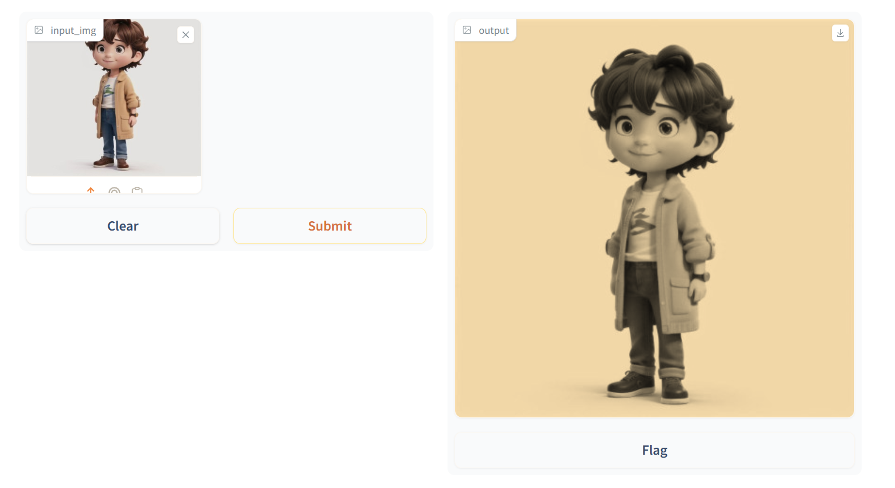


#### （4）动态界面接口：简单计算器模板实时变化

在Interface添加**live=True**参数，只要输入发生变化，结果马上发生改变。

```python
import gradio as gr

def calculator(num1, operation, num2):
    if operation == "add":
        return num1 + num2
    elif operation == "subtract":
        return num1 - num2
    elif operation == "multiply":
        return num1 * num2
    elif operation == "divide":
        return num1 / num2

demo = gr.Interface(
    calculator,
    ["number", gr.Radio(["add", "subtract", "multiply", "divide"]), "number"],
    "number",
    live=True,
)

demo.launch()
```

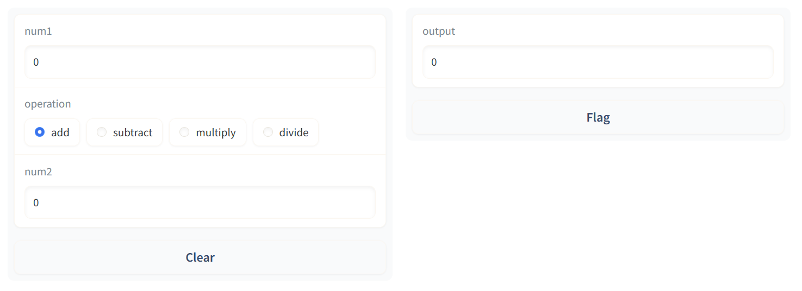

- 简单计算器制作

```python
import gradio as gr

# 一个简单计算器，含实例说明
def calculator(num1, operation, num2):
    if operation == "add":
        return num1 + num2
    elif operation == "subtract":
        return num1 - num2
    elif operation == "multiply":
        return num1 * num2
    elif operation == "divide":
        if num2 == 0:
            # 设置报错弹窗
            raise gr.Error("Cannot divide by zero!")
        return num1 / num2

demo = gr.Interface(
    calculator,
    # 设置输入
    [
        "number",
        gr.Radio(["add", "subtract", "multiply", "divide"]),
        "number"
    ],
    # 设置输出
    "number",
    # 设置输入参数示例
    examples=[
        [5, "add", 3],
        [4, "divide", 2],
        [-4, "multiply", 2.5],
        [0, "subtract", 1.2],
    ],
    # 设置网页标题
    title="Toy Calculator",
    # 左上角的描述文字
    description="Here's a sample toy calculator. Enjoy!",
    # 左下角的文字
    article = "Check out the examples",
)

demo.launch()
```

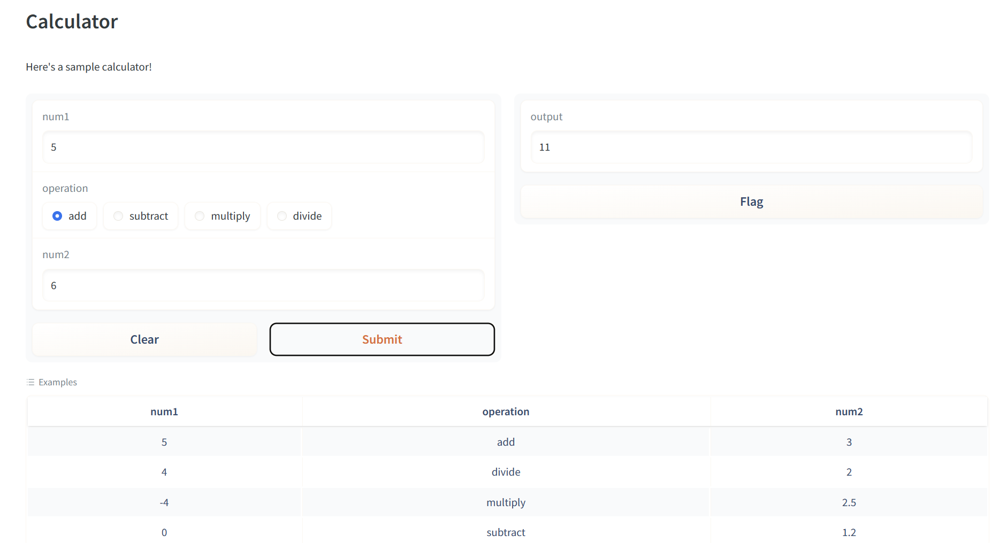


## 2. Interface进阶使用

### 2.1 Interface状态

#### （1）全局变量

全局变量的好处就是在调用函数后仍然能够保存，例如在机器学习中通过全局变量从外部加载一个大型模型，并在函数内部使用它，以便每次函数调用都不需要重新加载模型。下面就展示了全局变量使用的好处。

```python
import gradio as gr

scores = []

def track_score(score):
    scores.append(score)
    # 返回分数top3
    top_scores = sorted(scores, reverse=True)[:3]
    return top_scores

demo = gr.Interface(
    track_score,
    gr.Number(label="Score"),
    gr.JSON(label="Top Scores")
)

demo.launch()
```


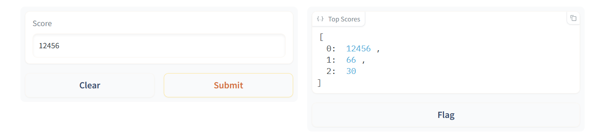


#### （2）会话状态

Gradio支持的另一种数据持久性是会话状态，数据在一个页面会话中的多次提交中持久存在。然而，数据不会在你模型的不同用户之间共享。会话状态的典型例子就是聊天机器人，你想访问用户之前提交的信息，但你不能将聊天记录存储在一个全局变量中，因为那样的话，聊天记录会在不同的用户之间乱成一团。注意该状态会在每个页面内的提交中持续存在，但如果你在另一个标签页中加载该演示（或刷新页面），该演示将不会共享聊天历史。

要在会话状态下存储数据，需要做三件事：

- 在你的函数中传入一个额外的参数，它代表界面的状态。
- 在函数的最后，将状态的更新值作为一个额外的返回值返回。
- 在添加输入和输出时添加state组件。

```python
import random
import gradio as gr

def chat(message, history):
    history = history or []
    message = message.lower()
    if message.startswith("how many"):
        response = random.randint(1, 10)
    elif message.startswith("how"):
        response = random.choice(["Great", "Good", "Okay", "Bad"])
    elif message.startswith("where"):
        response = random.choice(["Here", "There", "Somewhere"])
    else:
        response = "I don't know"
    history.append((message, response))
    return history, history

# 设置一个对话窗
chatbot = gr.Chatbot()

demo = gr.Interface(
    chat,
    # 添加state组件
    ["text", "state"],
    [chatbot, "state"],
    # 设置没有保存数据的按钮
    allow_flagging="never",
)

demo.launch()
```


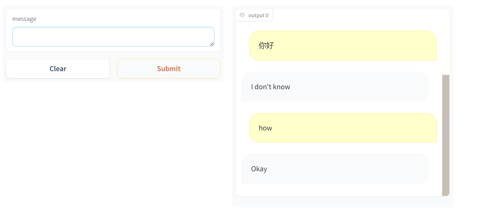

## 3. 自定制组件：Blocks构建应用

相比Interface，Blocks提供了一个低级别的API，用于设计具有更灵活布局和数据流的网络应用。Blocks允许控制组件在页面上出现的位置，处理复杂的数据流（例如，输出可以作为其他函数的输入），并根据用户交互更新组件的属性可见性。可以定制更多组件，[更多详细定制可查看文档](https://link.zhihu.com/?target=https%3A//gradio.app/docs/)

### 3.1 简单演示

```python
import gradio as gr

def greet(name):
    return "Hello " + name + "!"

with gr.Blocks() as demo:
    # 设置输入组件
    name = gr.Textbox(label="Name")
    # 设置输出组件
    output = gr.Textbox(label="Output Box")
    # 设置按钮
    greet_btn = gr.Button("Greet")
    # 设置按钮点击事件
    greet_btn.click(fn=greet, inputs=name, outputs=output)
    
demo.launch()
```

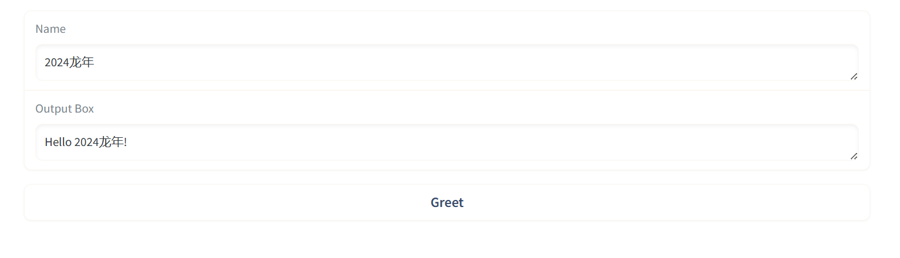


Blocks方式需要with语句添加组件，如果不设置布局方式，那么组件将按照创建的顺序垂直出现在应用程序中，运行界面

### 3.2 多模块应用

```python
import numpy as np
import gradio as gr

def flip_text(x):
    return x[::-1]

def flip_image(x):
    return np.fliplr(x)

with gr.Blocks() as demo:
    # 用markdown语法编辑输出一段话
    gr.Markdown("Flip text or image files using this demo.")
    # 设置tab选项卡
    with gr.Tab("Flip Text"):
        # Blocks特有组件，设置所有子组件按垂直排列
        # 垂直排列是默认情况，不加也没关系
        with gr.Column():
            text_input = gr.Textbox()
            text_output = gr.Textbox()
            text_button = gr.Button("Flip")
    with gr.Tab("Flip Image"):
        # Blocks特有组件，设置所有子组件按水平排列
        with gr.Row():
            image_input = gr.Image()
            image_output = gr.Image()
        image_button = gr.Button("Flip")
    # 设置折叠内容
    with gr.Accordion("Open for More!"):
        gr.Markdown("Look at me...")
    text_button.click(flip_text, inputs=text_input, outputs=text_output)
    image_button.click(flip_image, inputs=image_input, outputs=image_output)
    
demo.launch()
```


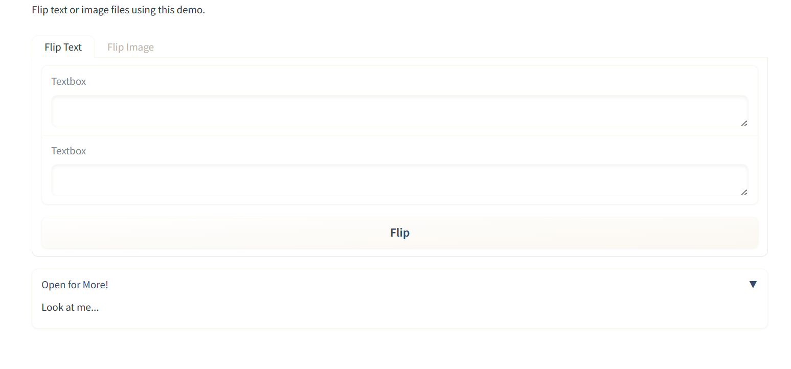


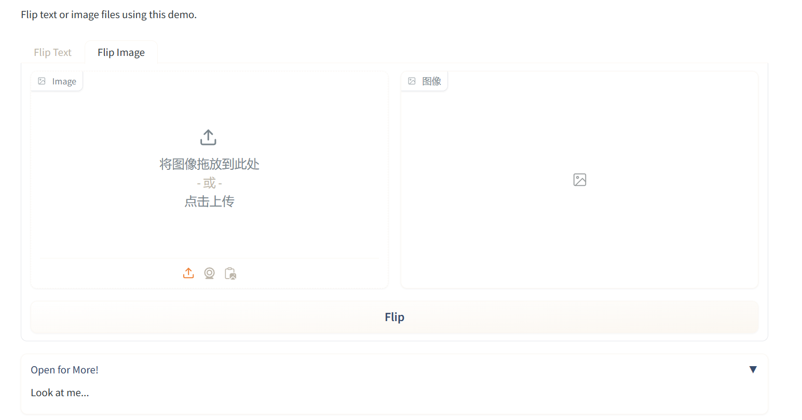


### 3.3 Flagging标记

相信有小伙伴已经注意到，输出框下有个Flag按钮。当测试您的模型的用户看到某个输入导致输出错误或意外的模型行为，他们可以标记这个输入让开发者知道。这个文件夹由Interface的flagging_dir参数指定，默认为’flagged’。将这些会导致错误的输入保存到一个csv文件。如果Interface包含文件数据，文件夹也会创建来保存这些标记数据。

打开log.csv展示如下：

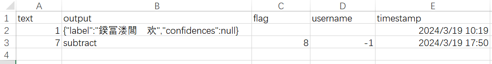


### 3.4 样式、队列、生成器

- 样式

在Gradio官方文档，搜索不同的组件加.style（如image.style），可以获取该组件的样式参数设置样例。例如image组件的设置如下：

```python
img = gr.Image("lion.jpg").style(height='24', rounded=False)
```

- 队列 

  如果函数推理时间较长，比如目标检测；或者应用程序处理流量过大，则需要使用queue方法进行排队。queue方法使用websockets，可以防止网络超时。使用方式如下：

```python
demo = gr.Interface(...).queue()
demo.launch()

#或
with gr.Blocks() as demo:
    #...
demo.queue()
demo.launch()
```

- 生成器

在某些情况下，你可能想显示一连串的输出，而不是单一的输出。例如，你可能有一个图像生成模型，如果你想显示在每个步骤中生成的图像，从而得到最终的图像。在这种情况下，你可以向Gradio提供一个生成器函数，而不是一个常规函数。下面是一个生成器的例子，每隔1秒返回1张图片。

```python
import gradio as gr
import numpy as np
import time

# 生成steps张图片，每隔1秒钟返回
def fake_diffusion(steps):
    for _ in range(steps):
        time.sleep(1)
        image = np.random.randint(255, size=(300, 600, 3))
        yield image
        
demo = gr.Interface(fake_diffusion,
                    # 设置滑窗，最小值为1，最大值为10，初始值为3，每次改动增减1位
                    inputs=gr.Slider(1, 10, value=3, step=1),
                    outputs="image")

# 生成器必须要queue函数
demo.queue()
demo.launch()
```

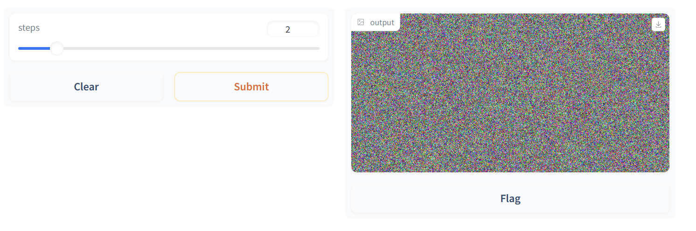

## 4. Blocks进阶使用

### 4.1 Blocks事件

#### （1）可交互设置

任何输入的组件内容都是可编辑的，而输出组件默认是不能编辑的。如果想要使得输出组件内容可编辑，设置interactive=True即可。

```python
import gradio as gr

def greet(name):
    return "Hello " + name + "!"

with gr.Blocks() as demo:
    name = gr.Textbox(label="Name")
    # 不可交互
    # output = gr.Textbox(label="Output Box")
    # 可交互
    output = gr.Textbox(label="Output", interactive=True)
    greet_btn = gr.Button("Greet")
    greet_btn.click(fn=greet, inputs=name, outputs=output)
    
demo.launch()
```

#### （2）事件设置

我们可以为不同的组件设置不同事件，如为输入组件添加change事件。可以进一步查看官方文档，看看组件还有哪些事件。

```python
import gradio as gr

def welcome(name):
    return f"Welcome to Gradio, {name}!"

with gr.Blocks() as demo:
    gr.Markdown(
    """
    # Hello World!
    Start typing below to see the output.
    """)
    inp = gr.Textbox(placeholder="What is your name?")
    out = gr.Textbox()
    # 设置change事件
    inp.change(fn = welcome, inputs = inp, outputs = out)
    
demo.launch()
```

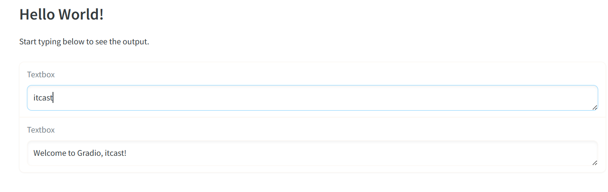

#### （3）多个数据流

如果想处理多个数据流，只要设置相应的输入输出组件即可。

```python
import gradio as gr

def increase(num):
    return num + 1

with gr.Blocks() as demo:
    a = gr.Number(label="a")
    b = gr.Number(label="b")
    # 要想b>a，则使得b = a+1
    atob = gr.Button("b > a")
    atob.click(increase, a, b)
    # 要想a>b，则使得a = b+1
    btoa = gr.Button("a > b")
    btoa.click(increase, b, a)
    
demo.launch()
```


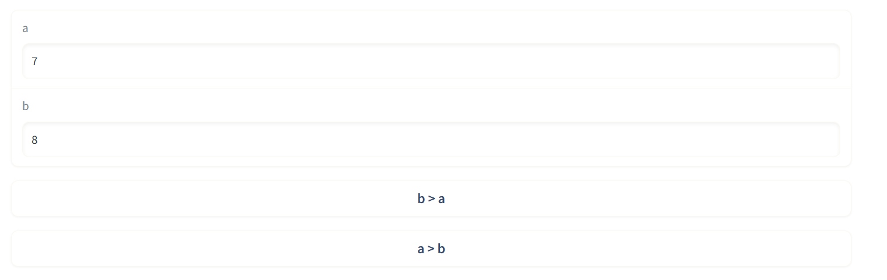


#### （4）多输出值处理

- 下面的例子展示了输出多个值时，以列表形式表现的处理方式。

```python
import gradio as gr

with gr.Blocks() as demo:
    food_box = gr.Number(value=10, label="Food Count")
    status_box = gr.Textbox()
    def eat(food):
        if food > 0:
            return food - 1, "full"
        else:
            return 0, "hungry"
    gr.Button("EAT").click(
        fn=eat,
        inputs=food_box,
        # 根据返回值改变输入组件和输出组件
        outputs=[food_box, status_box]
    )
    
demo.launch()
```


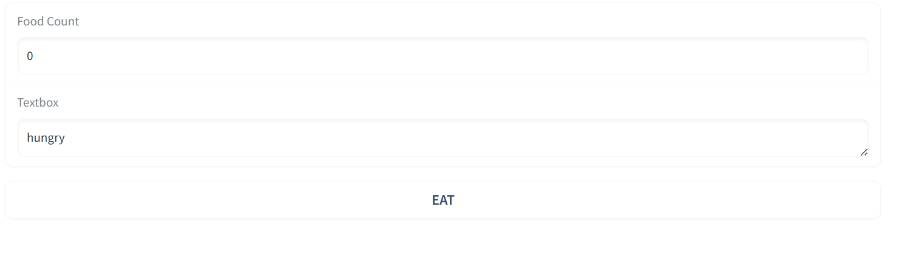

#### （5）组件配置修改

事件监听器函数的返回值通常是相应的输出组件的更新值。有时我们也想更新组件的配置，比如说可见性。在这种情况下，我们可以通过返回update函数更新组件的配置。

```python
import gradio as gr

def change_textbox(choice):
    # 根据不同输入对输出控件进行更新
    if choice == "short":
        return gr.update(lines=2, visible=True, value="Short story: ")
    elif choice == "long":
        return gr.update(lines=8, visible=True, value="Long story...")
    else:
        return gr.update(visible=False)
    
with gr.Blocks() as demo:
    radio = gr.Radio(
        ["short", "long", "none"], label="Essay Length to Write?"
    )
    text = gr.Textbox(lines=2, interactive=True)
    radio.change(fn=change_textbox, inputs=radio, outputs=text)
    
demo.launch()
```


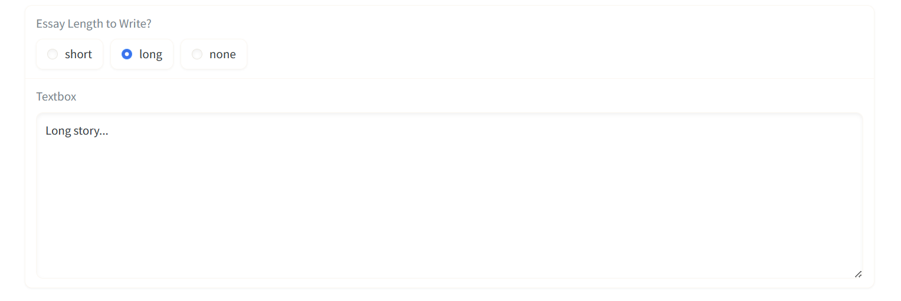

### 4.2 Blocks布局

Blocks应用的是html中的flexbox模型布局，默认情况下组件垂直排列。

#### （1）组件水平排列

使用Row函数会将组件按照水平排列，但是在Row函数块里面的组件都会保持同等高度。

```python
import gradio as gr

with gr.Blocks() as demo:
    with gr.Row():
        img1 = gr.Image()
        text1 = gr.Text()
    btn1 = gr.Button("button")
    
demo.launch()
```

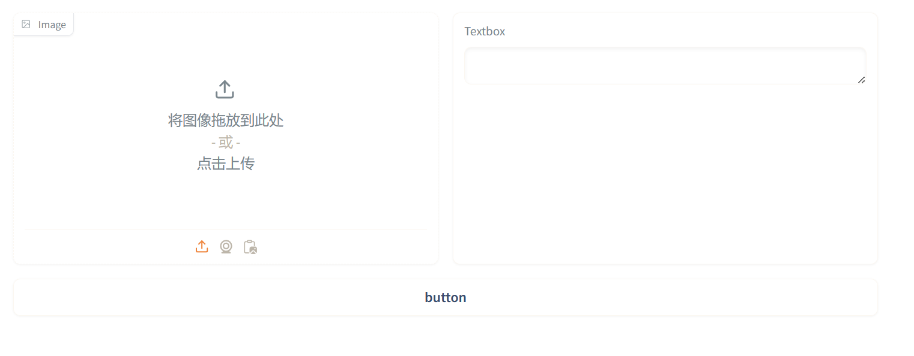

#### （2）组件垂直排列与嵌套

组件通常是垂直排列，我们可以通过Row函数和Column函数生成不同复杂的布局。

```python
import gradio as gr

with gr.Blocks() as demo:
    with gr.Row():
        text1 = gr.Textbox(label="t1")
        slider2 = gr.Textbox(label="s2")
        drop3 = gr.Dropdown(["a", "b", "c"], label="d3")
        
    with gr.Row():
        # scale与相邻列相比的相对宽度。例如，如果列A的比例为2，列B的比例为1，则A的宽度将是B的两倍。
        # min_width设置最小宽度，防止列太窄
        with gr.Column(scale=2, min_width=600):
            text1 = gr.Textbox(label="prompt 1")
            text2 = gr.Textbox(label="prompt 2")
            inbtw = gr.Button("Between")
            text4 = gr.Textbox(label="prompt 1")
            text5 = gr.Textbox(label="prompt 2")
            
        with gr.Column(scale=1, min_width=600):
            img1 = gr.Image("test.jpg")
            btn = gr.Button("Go")
            
demo.launch()
```

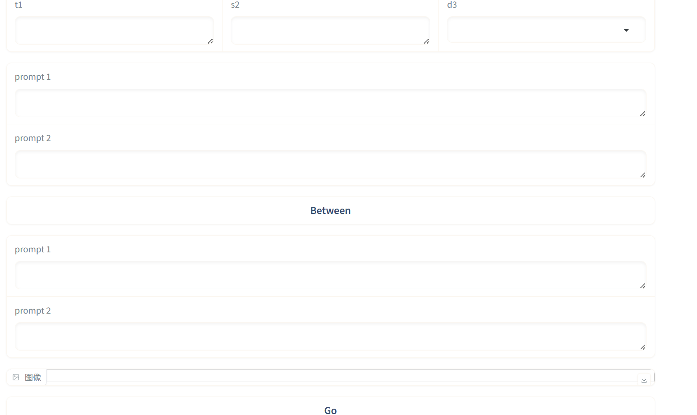

#### （3）组件可视化：输出可视化从无到有

如下所示，我们可以通过visible和update函数构建更为复杂的应用。

```python
import gradio as gr

with gr.Blocks() as demo:
    # 出错提示框
    error_box = gr.Textbox(label="Error", visible=False)
    # 输入框
    name_box = gr.Textbox(label="Name")
    age_box = gr.Number(label="Age")
    symptoms_box = gr.CheckboxGroup(["Cough", "Fever", "Runny Nose"])
    submit_btn = gr.Button("Submit")
    
    # 输出不可见
    with gr.Column(visible=False) as output_col:
        diagnosis_box = gr.Textbox(label="Diagnosis")
        patient_summary_box = gr.Textbox(label="Patient Summary")
        
    def submit(name, age, symptoms):
        if len(name) == 0:
            return {error_box: gr.update(value="Enter name", visible=True)}
        if age < 0 or age > 200:
            return {error_box: gr.update(value="Enter valid age", visible=True)}
        return {
            output_col: gr.update(visible=True),
            diagnosis_box: "covid" if "Cough" in symptoms else "flu",
            patient_summary_box: f"{name}, {age} y/o"
        }
        
    submit_btn.click(
        submit,
        [name_box, age_box, symptoms_box],
        [error_box, diagnosis_box, patient_summary_box, output_col],
    )
    
demo.launch()
```

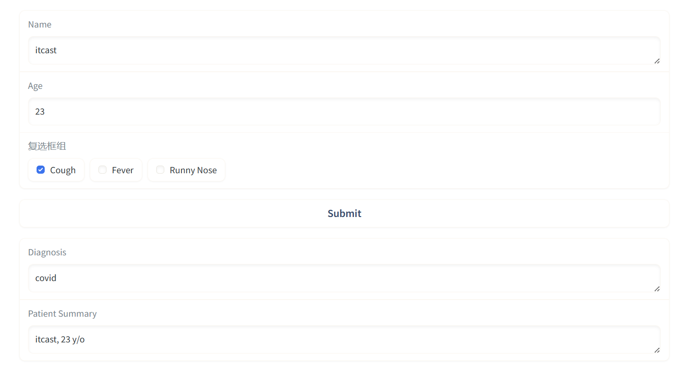


#### （4）组件渲染：点击作为输入

在某些情况下，你可能希望在实际的UI中呈现组件之前定义组件。例如，你可能希望在相应的gr.Textbox输入上方显示使用gr.examples的示例部分。

由于gr.Examples需要输入组件对象作为参数，因此你需要先定义输入组件，然后在定义gr.Exmples对象后再进行渲染。

**解决方法：**在gr.Blocks()范围外定义gr.Textbox，并在UI中希望放置的任何位置使用组件的.render()方法。

```python
import gradio as gr

input_textbox = gr.Textbox()

with gr.Blocks() as demo:
    # 提供示例输入给input_textbox，示例输入以嵌套列表形式设置
    gr.Examples(["hello", "bonjour", "merhaba"], input_textbox)
    # render函数渲染input_textbox
    input_textbox.render()
    
demo.launch()
```

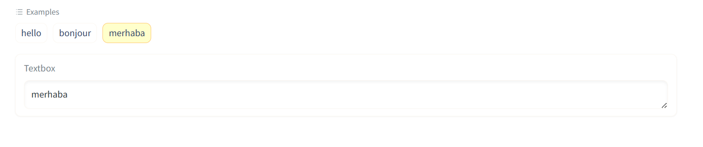


### 4.3 样式修改

#### （1）自定义css

要获得额外的样式功能，你可以设置行内css属性将任何样式给应用程序。如下所示。

```python
import gradio as gr

# 修改blocks的背景颜色
with gr.Blocks(css=".gradio-container {background-color: red}") as demo:
    box1 = gr.Textbox(value="Good Job")
    box2 = gr.Textbox(value="Failure")
    
demo.launch()
```

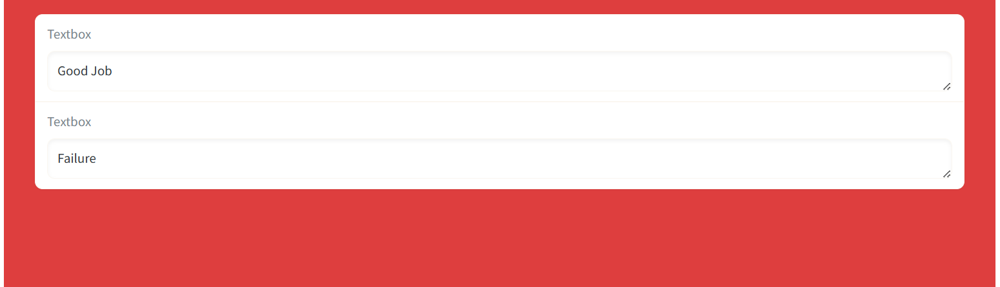


#### （2）元素选择

你可以向任何组件添加HTML元素。通过elem_id选择对应的css元素。

```python
import gradio as gr

# 这里用的是id属性设置
with gr.Blocks(css="#warning {background-color: red}") as demo:
    box1 = gr.Textbox(value="Good Job", elem_id="warning")
    box2 = gr.Textbox(value="Failure")
    box3 = gr.Textbox(value="None", elem_id="warning")
    
demo.launch()
```

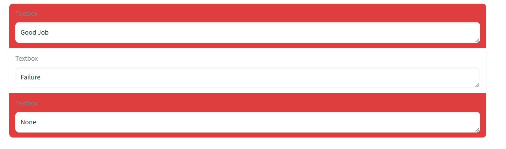
